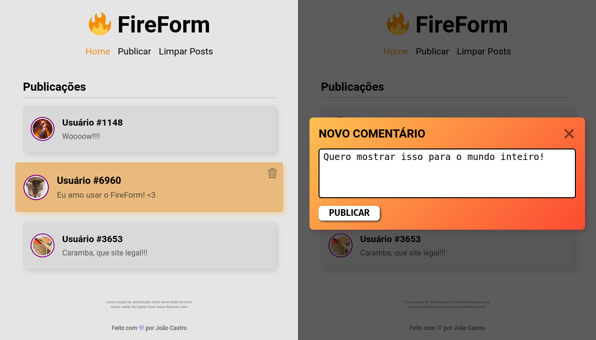

<h1 align="center">
  🔥 <b>FireForm</b>
</h1>

  

## 💻 O que é?

FireForm é um projeto criado para praticar minha habilidades em inserir elementos HTML via JavaScript puro. 

A aplicação consiste em uma página em que podem ser criadas postagens e as existentes podem ser excluidas.

As informações das postagens ficam guardadas em um JSON em fomrato de string que é salvo do localStorage do dispositivo. Então mesmo que o usuário saia da página, o dados inseridos por ele estarão salvos.

## 🚀 Tecnologias

Esse projeto foi desenvolvido com as seguintes tecnologias:

- HTML
- CSS
- JavaScript

---

Desenvolvido com 💜 por **[João Castro](https://github.com/joaofbcastro)**.
